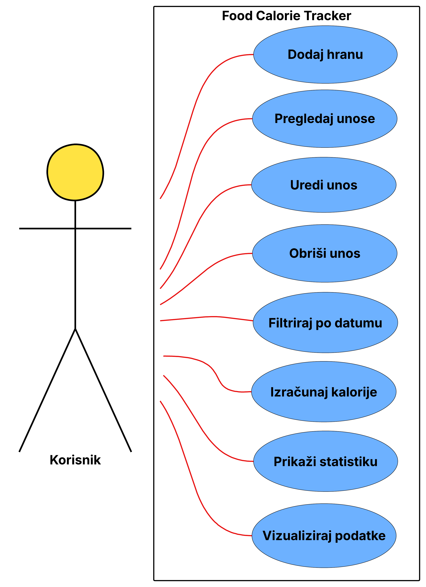

# FOOD CALORIE TRACKER

 Food Calorie Tracker je web aplikacija namijenjena praćenju dnevnog unosa kalorija. Aplikacija omogućuje korisniku jednostavno vođenje evidencije o konzumiranoj hrani kroz unos naziva hrane, broja kalorija i datuma unosa.Korisnik može dodavati nove unose hrane, pregledavati sve spremljene unose, uređivati postojeće podatke te brisati unose koji više nisu potrebni. Kako bi pregled podataka bio jednostavniji, aplikacija omogućuje filtriranje unosa prema odabranom datumu.Osim osnovnih CRUD funkcionalnosti, aplikacija sadrži i modul za statistiku koji prikazuje ukupan broj unosa, ukupnu količinu unesenih kalorija, prosječnu količinu kalorija po unosu te grafički prikaz kalorijskog unosa po danima. Korisnik također može definirati dnevni kalorijski cilj te pratiti koliko je kalorija preostalo do ostvarenja cilja ili je li cilj prekoračen.Podaci se pohranjuju u SQLite bazu podataka korištenjem PonyORM biblioteke, dok je korisničko sučelje izrađeno pomoću HTML-a, CSS-a i Bootstrapa. Za vizualizaciju podataka korištena je biblioteka Chart.js, a cijela aplikacija razvijena je kao Flask web servis te se može pokretati lokalno ili unutar Docker kontejnera.

# Use case dijagram

# Funkcionalnosti
-  Dodavanje hrane
-  Pregled unosa hrane
-  Uređivanje postojećih unosa
-  Brisanje unosa
-  Filtriranje po datumu
-  Izračun ukupnog unosa kalorija
-  Prikaz statistike kalorija
-  Vizualizacija podataka pomoću grafikona

### Instalacija

Skidanje koda s GitHub-a:

cd ~/Downloads

https://github.com/Dario-Si/Food_Calorie_Tracker.git

cd Food_Calorie_Tracker

### Docker 

Pokretanje dockera

docker build -t food-calorie-tracker .

docker run -p 5000:5000 food-calorie-tracker

http://localhost:5000
